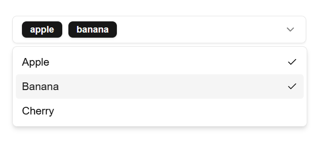

# shadcn/ui Multi Select Component



## Manual install

### React 19 required!

```sh
npx shadcn@latest add select badge
```

[Cpoy code](/src/components/ui/multi-select.tsx)

## Preview

```sh
pnpm i
pnpm dev
```

## API Reference

[shadcn/ui](https://ui.shadcn.com/docs/components/select)
[Radix-UI](https://www.radix-ui.com/primitives/docs/components/select)

```typescript
export type MultiSelectProps = Omit<
  React.ComponentProps<typeof SelectPrimitive.Root>,
  "value" | "onValueChange" | "defaultValue"
> & {
  value?: string[];
  onValueChange?: (value: string[]) => void;
} & {
  defaultValue?: string[];
};
```
